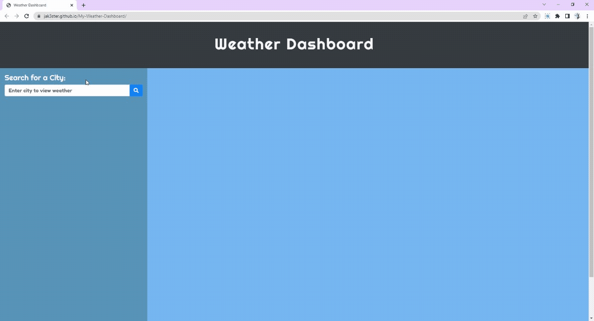

# My-Weather-Dashboard

Weather dashboard application

## Description

This homework helped me create a weather dashboard application that uses the [OpenWeather One Call API](https://openweathermap.org/api/one-call-api) to retrieve weather data for cities. This app runs in the browser and features dynamically updated HTML, CSS and jQuery. Using `localStorage` to store any persistent data.

The activities this week help familiarize CURL debugging, create fetch call using different and reverse APIs, parsing JSON data, using network activity in the browser to troubleshoot, fetch status, fetch options, document location and GIT repo and collaboration.

## Installation

1. Download or clone repository
2. Open the main page (index.html) on your browser to view webpage
3. Use a text editor to view all coding, Visual Studio Code (recommended editor)

## Usage

1. Once My Weather Dashboard page launches
2. In the search field enter a city shows the current and future conditions for that city and that city is added to the search history
3. Shows the current weather conditions for that city and presented with the city name, the date, an icon representation of weather conditions, the temperature, the humidity, the wind speed and the UV index
4. Shows the UV index with a color that indicates whether the conditions are favorable, moderate, or severe
    * ![#3EA72D] 0-2 Low
    * ![#FFF300] 3-5 Moderate
    * ![#F18B00] 6-7 Orange
    * ![#E53210] 8-10 Very High
    * ![#B567A4] 11+ Extreme
    * Reference: [Ultraviolet Index Wikipeadia](https://en.wikipedia.org/wiki/Ultraviolet_index)
5. Showing the future weather conditions for that city, a 5-day forecast displays the date, an icon representation of weather conditions, the temperature, the wind speed, and the humidity
6. When a city in the search history the current and future conditions for that city is presented again
7. Refresh the page and the last searched city forecast is presented

## Features

* HTML
* CSS
* Server-side API using OpenWeather API
* jQuery
* Bootstrap
* Moment.js

## Demo

## Website & Repository

* Deployed Link: <https://jak3ster.github.io/My-Weather-Dashboard>
* Github Repository: <https://github.com/jak3ster/My-Weather-Dashboard>
